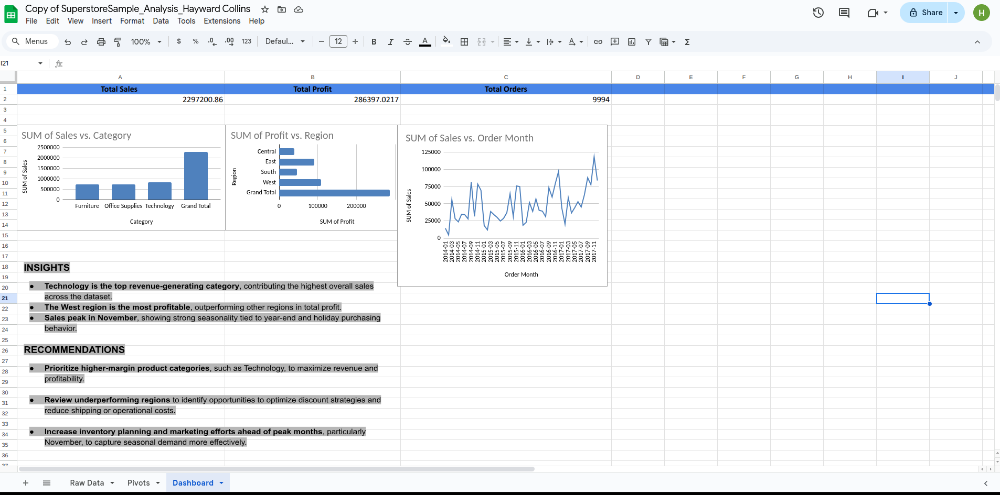

# superstore-sales-analysis
Business performance and sales insights analysis using Google Sheets dashboards.

## Live Dashboard
View the interactive Google Sheets dashboard (view-only):  
https://docs.google.com/spreadsheets/d/1SVGEwNMmcsMew8quy0zfvnIGHW22DttTsGcuZm_P1vA/edit?usp=drivesdk

## Dashboard Preview

---

# Superstore Sales Performance Analysis

This project analyzes retail sales and profitability data to uncover revenue trends, profit drivers, and seasonal patterns that support business decision-making.

The analysis demonstrates practical data analytics skills including data preparation, pivot table analysis, dashboard design, and insight generation using Excel / Google Sheets.

---

## 🔍 Business Questions Addressed

This analysis answers key business questions such as:
1. Which product categories generate the most revenue?
2. Which regions are the most and least profitable?
3. How do sales trends change over time?
4. What actions can improve profitability and operational performance?

---

## 📊 Dashboard Overview

The final dashboard summarizes:
- **Total Sales**
- **Total Profit**
- **Total Orders**
- Sales by product category
- Profit by region
- Monthly sales trends

The dashboard is designed for quick interpretation by non-technical stakeholders.

---

## 💡 Key Insights

- **Technology** is the top revenue-generating product category across the dataset.
- The **West region** is the most profitable, outperforming other regions in total profit.
- Sales consistently **peak in November**, indicating strong seasonality tied to year-end purchasing.

---

## 📌 Recommendations

- Prioritize higher-margin product categories such as Technology to maximize revenue and profitability.
- Review underperforming regions to optimize discount strategies and reduce shipping or operational costs.
- Increase inventory planning and marketing efforts ahead of peak months, particularly November, to capture seasonal demand.

---

## 🛠 Tools & Techniques Used

- Excel / Google Sheets
- Pivot Tables
- Charts (Bar and Line Charts)
- KPI Reporting
- Business Insight Analysis

---

## 🚀 About the Analyst

I specialize in Excel-based data analysis and reporting, focusing on transforming raw business data into clear, actionable insights. I am actively pursuing remote data analyst, reporting analyst, and contract analytics opportunities.
